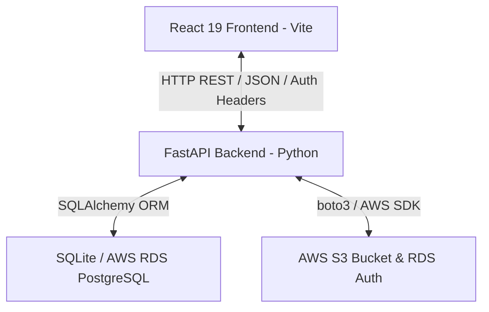

# AISurf Project Workflow & Architecture Guide

Welcome to the comprehensive workflow guide for the **AISurf** application. The codebase is organized into two primary folders: a **Vite + React Frontend** (`/frontend`) and a **FastAPI Python Backend** (`/backend`).

Below is a detailed breakdown of the components, database structures, security protocols, and operational workflows of this platform.

---

## 1. System Technology Stack



### Frontend (`/frontend`)
- **Framework**: React 19 powered by Vite for rapid HMR (Hot Module Replacement).
- **Routing**: `react-router-dom` (v7) managing protected browser routes.
- **Styling**: Vanilla CSS utilizing custom HSL design tokens in `index.css` for a high-performance theme (dark `#050B1A` for video/competitions, clean white/slate `#F8FAFC` for athlete dashboards).
- **Mock Service Interceptor**: `mockFetch.js` provides a complete client-side database simulation, intercepting `/api` endpoints so the application can run in a fully offline/mock state.

### Backend (`/backend`)
- **Framework**: FastAPI (Python) for asynchronous endpoints.
- **ORM & DB**: SQLAlchemy, connecting to:
  1. A local SQLite database (`aisurf.db`) for offline development.
  2. A PostgreSQL database (AWS RDS Instance) automatically detected via connection URL checks.
- **Security**: Custom password hashing (PBKDF2-HMAC) and HMAC-SHA256 signed session tokens.
- **Storage**: Integrates S3 for media uploads and fetches IAM Database Authentication tokens from AWS RDS dynamically.

---

## 2. Core Database Schema & Entities

The SQL database (defined in [main.py](file:///d:/surfing/ai/backend/main.py)) handles the following tables:

| Table Name | Primary Purpose | Key Fields |
| :--- | :--- | :--- |
| `users` | RBAC Credentials & Provider Links | `id`, `email`, `password_hash`, `role` (athlete/coach/admin), `auth_provider` |
| `schools` | Surf Schools registration | `id`, `name`, `owner`, `email`, `website` |
| `instructors` | Coach bios, rates, and stats | `id`, `user_id`, `name`, `bio`, `specializations`, `rates`, `location` |
| `students` | Student athlete details | `id`, `user_id`, `name`, `level`, `instructor_id`, `stance`, `surf_stats` |
| `sessions` | Scheduled / In-Progress training logs | `id`, `date`, `time`, `student_id`, `instructor_id`, `status` |
| `nutrition_logs` | Daily caloric and hydration tracker | `id`, `student_id`, `date`, `calories`, `hydration_liters` |
| `sc_logs` | Strength & Conditioning metrics | `id`, `student_id`, `workout_details`, `sleep_score`, `recovery_score` |
| `technical_logs`| Wave metrics & local video attachment | `id`, `student_id`, `wave_count`, `board_setup`, `video_url` |
| `mental_logs` | Athlete mindset and heat prep metrics | `id`, `student_id`, `pre_heat_anxiety`, `focus_level` |
| `mock_heats` | Live competitive simulation history | `id`, `student_id`, `coach_id`, `heat_total`, `priority_status`, `wave_progression` |

---

## 3. End-to-End Core Workflows

### A. Role-Based Authentication & SSO
1. **User Sign Up / Sign In**:
   - Users authenticate with their email and password or use simulated OAuth (Google/Apple ID) on the [AuthPage.jsx](file:///d:/surfing/ai/frontend/src/pages/AuthPage.jsx).
   - If signing up via Google/Apple SSO for the first time, an intermediate screen prompts the user to select their role (`athlete` or `coach`).
   - The backend hashes passwords using PBKDF2-HMAC with a SHA256 signature salt.
   - A secure token is generated containing `user_id`, `email`, and `role`, signed with HMAC-SHA256 using a static `SECRET_KEY`.
2. **Dynamic Routing**:
   - The frontend's `App.jsx` handles route permissions. Authenticated details are fetched via `GET /api/auth/me`.
   - The sidebar navigation changes dynamically:
     - **Admin**: Gains access to the Superadmin tab `/superadmin`, marketplace listings, integration webhooks, and user reports.
     - **Coach**: Allowed to view all delegated students, schedule sessions, and run live mock scoring heats.
     - **Athlete**: Redirects to the wellness portal (`AthleteIntelligence.jsx`) and private workout history.

---

### B. Athlete Intelligence & Wellness Portal
1. **Logging Dashboard**:
   - Under [AthleteIntelligence.jsx](file:///d:/surfing/ai/frontend/src/pages/AthleteIntelligence.jsx), students enter daily health data divided into four segments:
     - **Nutrition**: Meal timings, macronutrients, water consumption.
     - **S&C**: Muscle soreness, sleep durations, recovery percentages.
     - **Technical Training**: Number of waves caught, surfboard setups (thruster/quad), and video attachments.
     - **Mental prep**: Anxiety scores (1-10) and post-heat reviews.
2. **Aggregations**:
   - The frontend posts to `/api/students/{id}/logs/{category}`.
   - The summary dashboard requests `/api/students/{id}/logs/summary`, which automatically averages variables across logs to display stats like daily calories and sleep efficiency.

---

### C. Media Upload & Interactive Video Annotations
1. **Drag-and-Drop Uploader**:
   - Inside [NewSession.jsx](file:///d:/surfing/ai/frontend/src/pages/NewSession.jsx), a media upload card allows athletes to drag and drop video files.
   - These files are uploaded via a multi-part form boundary post to `/api/upload-video` or sent directly to AWS S3 if enabled.
2. **Interactive Drawing Board**:
   - In [VideoAnalysis.jsx](file:///d:/surfing/ai/frontend/src/pages/VideoAnalysis.jsx), the uploaded video loads below an HTML5 transparent `<canvas>`.
   - A drawing toolbar provides drawing instruments (Pen, Eraser, Undo, Clear, brush colors, stroke sizes).
   - Drawing coordinates map mouse or touch event positions relative to the canvas's bounding rectangle.
   - **Key Moments (Seeking)**: Videos show markers on the progress slider indicating points of interest. Clicking on these seekers pauses playback and instantly jumps to that video frame for posture study.

---

### D. Mock Heats Competition Engine
Located in [Competitions.jsx](file:///d:/surfing/ai/frontend/src/pages/Competitions.jsx), this reproduces live WSL/LiveHeats conditions:
1. **Setup**: The coach picks a student, sets a heat countdown (e.g., 20 mins), and writes down heat strategies.
2. **Live Interface**:
   - **Priority Status**: A toggle switches priority between "Athlete" and "Opponent".
   - **Wave Logging**: Coaches add waves with scores (0.0 to 10.0) and performance notes.
   - **Dynamic Scoring**: The heat total dynamically sums only the top 2 scored waves.
3. **AI Tactical Diagnoses**:
   - Once the heat finishes, the application triggers a rule-based AI feedback engine that parses wave score distributions.
   - It outputs bulleted strengths (e.g., *Consistent speed on turns*), weaknesses (*Inability to secure high back-up scores*), and specific targets.

---

## 4. Production Cloud Deployment Workflows

When the codebase is running on AWS (e.g., deployed on an EC2 instance linking to RDS and S3):

```
[FastAPI on EC2]
       │
       ├─► Generates temporary token via boto3 RDS Client ──► Authenticates with RDS PostgreSQL
       │
       └─► Verifies files and uploads to S3 Client ──────────► Stores surf logs
```

1. **RDS Passwordless Connection**:
   - Rather than storing hardcoded credentials, the backend uses `boto3.client("rds")` to generate an RDS DB authentication token at startup.
   - The token functions as a temporary password to log into the PostgreSQL tables securely.
2. **S3 Storage Fallback**:
   - When upload requests hit the API, the backend checks for AWS credential variables. If found, media files save inside the S3 bucket rather than the local filesystem folder `/uploads`.
3. **CORS Policies**:
   - The FastAPI backend includes `CORSMiddleware` with `allow_origins=["*"]` to ensure the React Vite browser instance successfully queries backend API routes.
